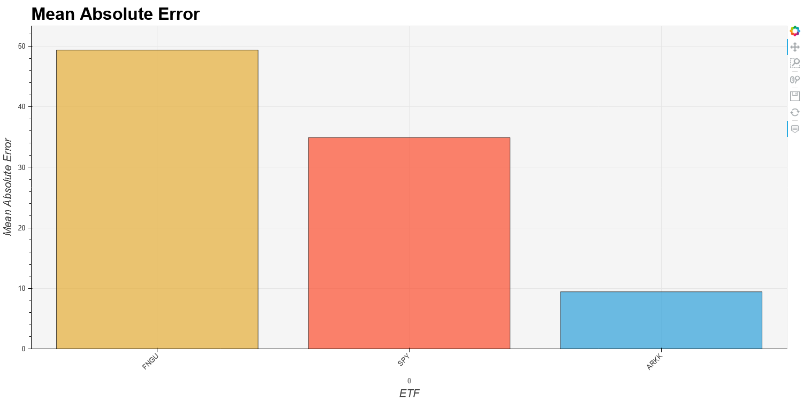
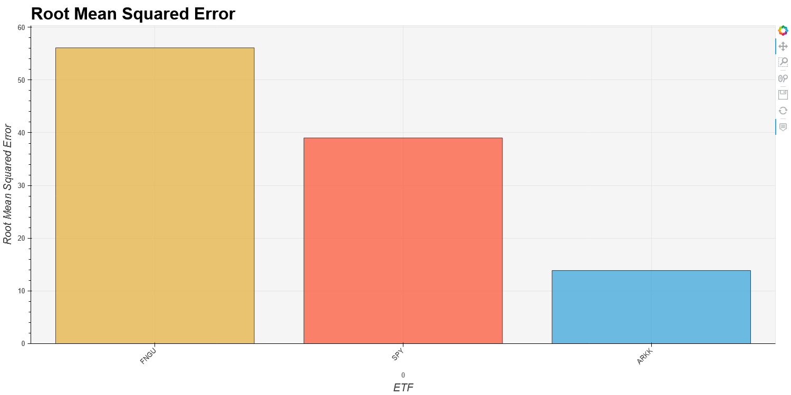
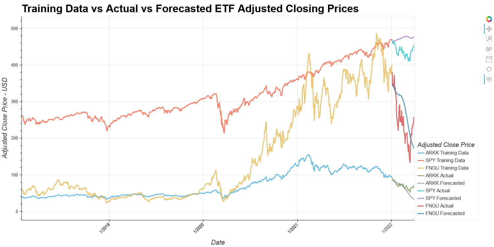
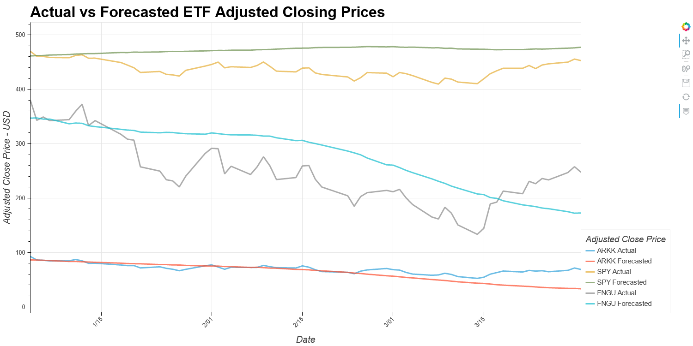
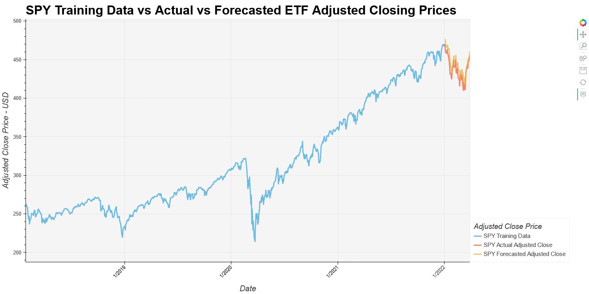
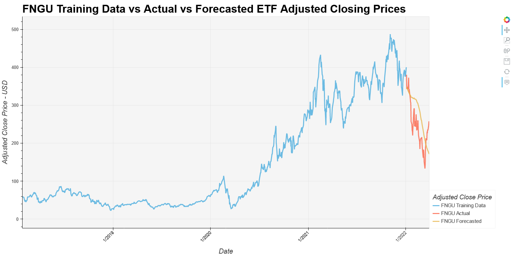
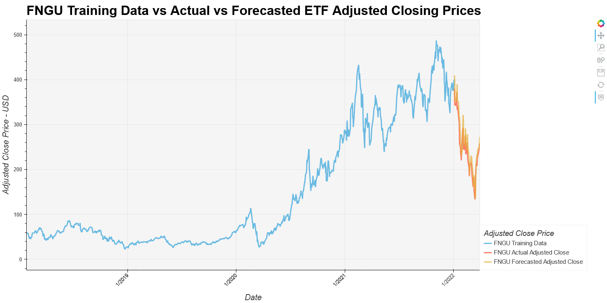
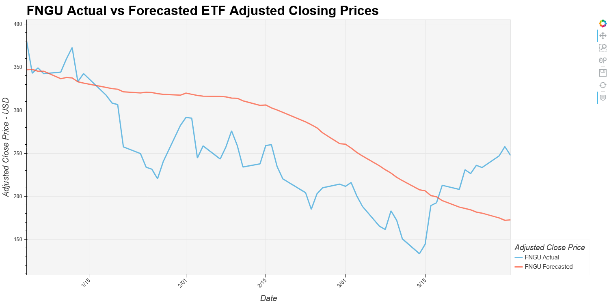
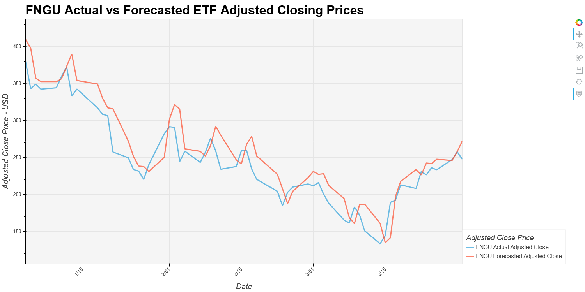

# ETF Forecasts
<hr>
In this project we are using historic ETF data from Yahoo Finance to predict/forecast historic ETF prices. The ETF's we are using are the ARK Innovation Fund (Ticker: ARKK), the SPDR S&P 500 ETF Trust (Ticker: SPY) and the Bank of Montreal MicroSectors FANG Index (Ticker: FNGU). We are using two machine learning models, the Facebook/Meta Prophet model as well as a Google Tensorflow LSTM Recurrent Neural Network models to predict/forecast these ETF prices. And we compare and contrast these different models and their performance against the real historic prices.

## [Video Presentation - Coming Soon]()

## Notebooks
- [Data Exploration](./Data_Exploration.ipynb)
- [Prophet Model Forecasting](./Prophet.ipynb)
- [LSTM RNN Model Forecasting](./LSTM_RNN.ipynb)

## Results
### Data
The data used was pulled from Yahoo Finance. The focus of the data was on three ETFs: ARKK, SPY, and FNGU. The timeframe of the data is from January of 2018 to March of 2022. To get a clear review and analysis of the data we used the Adjusted Close Price.

The Data is stored in a CSV and can be found here: [ETF Data CSV](./Resources/Data/etf_data.csv)


### Metrics Results
Facebook/Meta Prophet Models | Google Tensorflow LSTM RNN Models
:-------------------------:|:-------------------------:
**ARKK** - *Mean Absolute Error:* 9.43 | **ARKK** - *Mean Absolute Error:* 69.88
**SPY** - *Mean Absolute Error:* 34.92 | **SPY** - *Mean Absolute Error:* 436.76
**FNGU** - *Mean Absolute Error:* 49.36 | **FNGU** - *Mean Absolute Error:* 246.19
  |  
**ARKK** - *Mean Squared Error:* 192.27 | **ARKK** - *Mean Squared Error:* 4954.66
**SPY** - *Mean Squared Error:* 1522.05 | **SPY** - *Mean Squared Error:* 190968.11
**FNGU** - *Mean Squared Error:* 3147.08 | **FNGU** - *Mean Squared Error:* 64041.90
  |  
**ARKK** - *Root Mean Squared Error:* 13.87 | **ARKK** - *Root Mean Squared Error:* 70.39
**SPY** - *Root Mean Squared Error:* 39.01 | **SPY** - *Root Mean Squared Error:* 437.00
**FNGU** - *Root Mean Squared Error:* 56.10 | **FNGU** - *Root Mean Squared Error:* 253.07
  |  
### Forecasting Results
Facebook/Meta Prophet Models | Google Tensorflow LSTM RNN Models
:-------------------------:|:-------------------------:
**All 3 ETFs** - *Tickers*: **ARKK**, **SPY**, **FNGU** - *Training Data vs Actual vs Forecasted Adjusted Closing Price* | **All 3 ETFs** - *Tickers*: **ARKK**, **SPY**, **FNGU** - *Training Data vs Actual vs Forecasted Adjusted Closing Price*
  |  
**All 3 ETFs** - *Tickers*: **ARKK**, **SPY**, **FNGU** - Actual vs Forecasted Adjusted Closing Price | **All 3 ETFs** - *Tickers*: **ARKK**, **SPY**, **FNGU** - *Actual vs Forecasted Adjusted Closing Price*
  |  
**ARK Innovation ETF** - *Ticker:* **ARKK** - *Training Data vs Actual vs Forecasted Adjusted Closing Price* | **ARK Innovation ETF** - *Ticker:* **ARKK** - *Training Data vs Actual vs Forecasted Adjusted Closing Price*
  |  
**ARK Innovation ETF** - *Ticker:* **ARKK** - Actual vs Forecasted Adjusted Closing Price | **ARK Innovation ETF** - *Ticker:* **ARKK** - *Actual vs Forecasted Adjusted Closing Price*
  |  
**SPDR S&P 500 ETF Trust** - *Ticker:* **SPY** - *Training Data vs Actual vs Forecasted Adjusted Closing Price* | **SPDR S&P 500 ETF Trust** - *Ticker:* **SPY** - *Training Data vs Actual vs Forecasted Adjusted Closing Price*
  |  
**SPDR S&P 500 ETF Trust** - *Ticker:* **SPY** - Actual vs Forecasted Adjusted Closing Price | **SPDR S&P 500 ETF Trust** - *Ticker:* **SPY** - *Actual vs Forecasted Adjusted Closing Price*
  |  
**Bank of Montreal MicroSectors FANG Index** - *Ticker:* **FNGU** - *Training Data vs Actual vs Forecasted Adjusted Closing Price* | **Bank of Montreal MicroSectors FANG Index** - *Ticker:* **FNGU** - *Training Data vs Actual vs Forecasted Adjusted Closing Price*
  |  
**Bank of Montreal MicroSectors FANG Index** - *Ticker:* **FNGU** - Actual vs Forecasted Adjusted Closing Price | **Bank of Montreal MicroSectors FANG Index** - *Ticker:* **FNGU** - *Actual vs Forecasted Adjusted Closing Price*
  |  

### Facebook/Meta Prophet Model vs Tensorflow LSTM RNN Model Findings
@TODO

## Conclusion/Summary
@TODO

## Getting Started
### Prerequisites

You must have Python 3, Anaconda, Conda and Pip installed

```
$ python3 --version
Output: Python 3.10.8
$ anaconda --version
Output: anaconda Command line client (version 1.11.0)
$ conda --verison
Output: conda 22.9.0
$ pip --verison
Ouput: pip 22.2.2 from /Users/{#Username}/opt/anaconda3/lib/python3.9/site-packages/pip (python 3.9)
```

### Cloning Repo, Installing Dependencies & Running Jupyter
```
$ git clone git@github.com:SZun/ETF-Forecasts.git
$ cd ETF-Forecasts
$ sh install.sh
$ jupyter lab
```

## Built With
- [](https://www.tensorflow.org/) - Deep Learning Framework
- [](https://scikit-learn.org/stable/) - Machine Learning library
- [](https://pandas.pydata.org/docs/#) - Data analysis library
- [](https://numpy.org/) - Multi-dimensional array library
- []([https://www.python.org/downloads/release/python-3713/)
[](https://www.python.org/downloads/release/python-3713/) - Programming Language
- [](https://docs.conda.io/en/latest/) - Package manager
- [Prophet](https://facebook.github.io/prophet/) - Machine learnig library for forecasting
- [Yahoo Finance](https://matplotlib.org/) - Financial data API
- [Matplotlib](https://hvplot.holoviz.org/) - Visualization library 
- [Hvplot](https://hvplot.holoviz.org/) - Visualization library for Pandas-based plots
- [Seaborn](https://seaborn.pydata.org/)  - Visualization library
- [Pathlib](https://plotly.com/python/) - Python module for paths

## Contributors
- **Gabriel Millan** - [LinkedIn](https://www.linkedin.com/in/millangabriel/) | [Github](https://github.com/gjmillan)
- **Max Heatter** - [LinkedIn](https://www.linkedin.com/in/maxwell-heatter-ba4b03194/) | [Github](https://github.com/MaxHeatter)
- **Sam G. Zun** - [LinkedIn](https://www.linkedin.com/in/szun/) | [Github](https://github.com/SZun)
- **Tim Clemens** - [Github](https://github.com/AmericanHacker)

