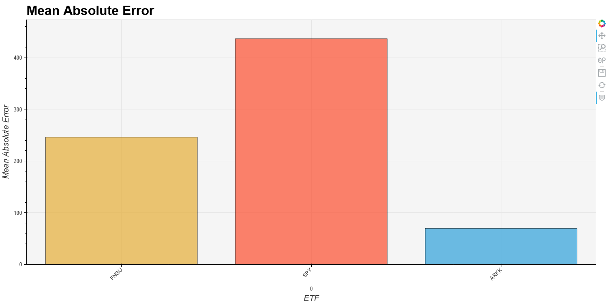
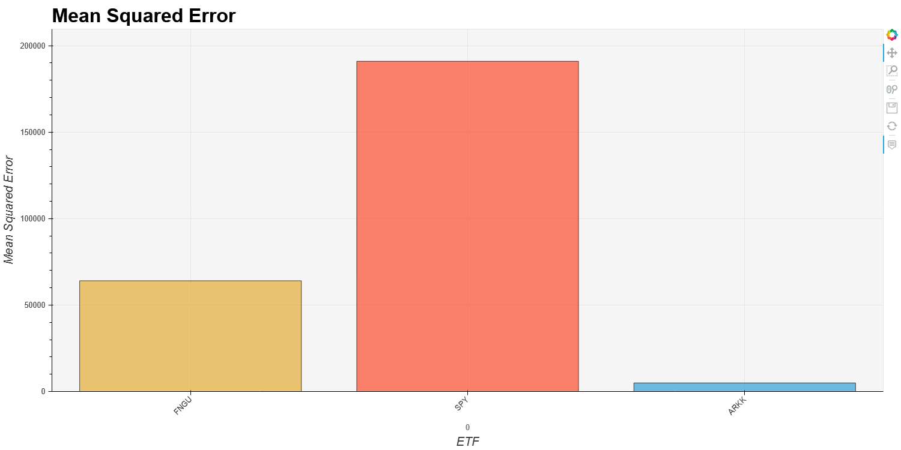
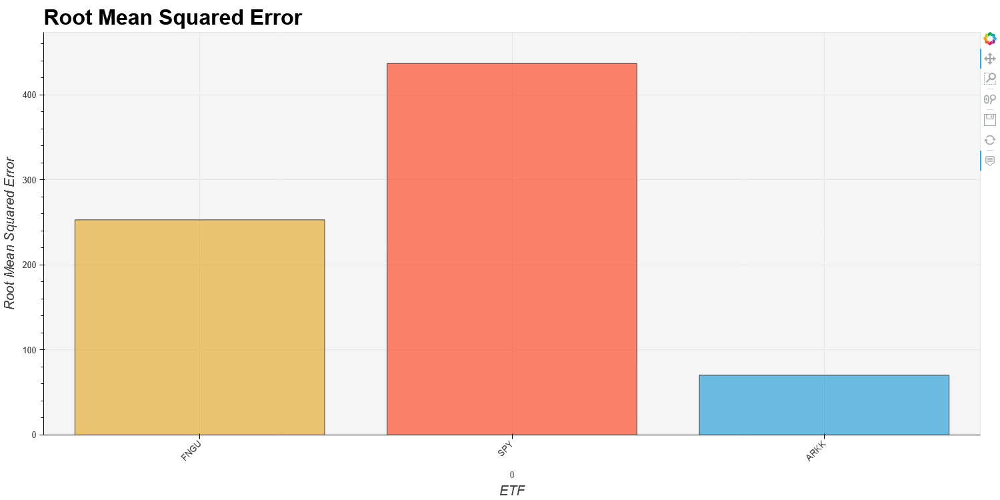
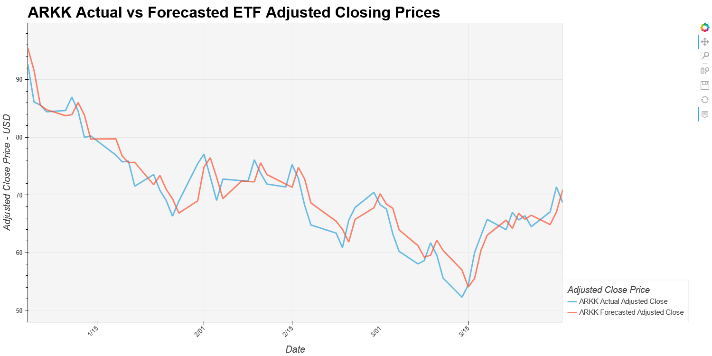
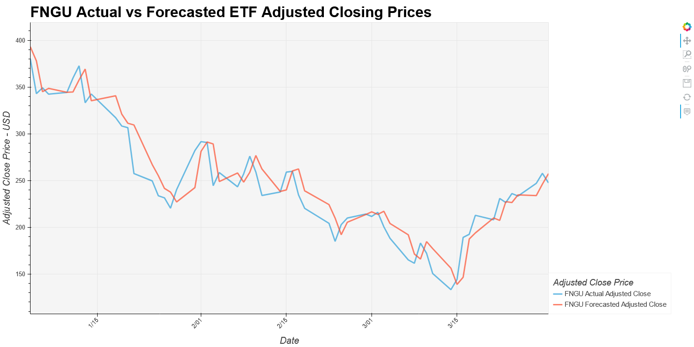
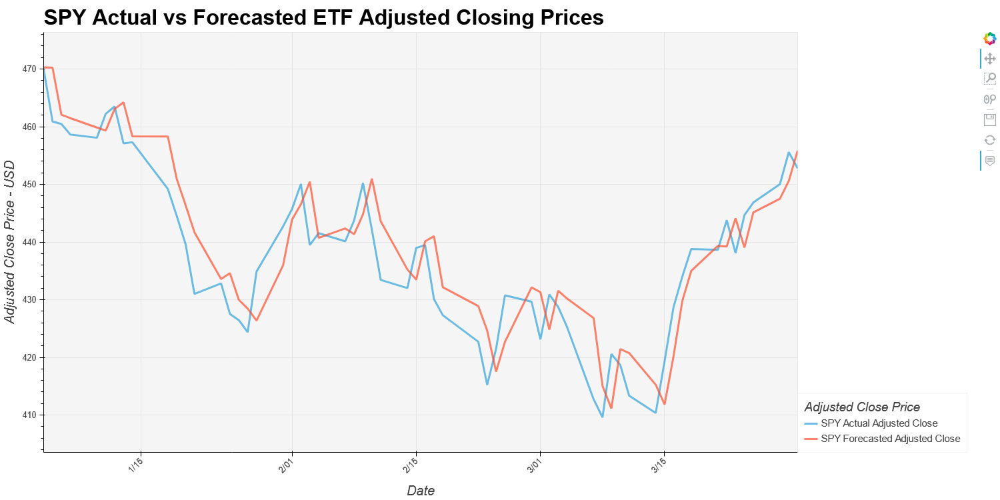

## LSTM Networks

Long Short Term Memory networks – usually just called “LSTMs” – are a special kind of RNN, capable of learning long-term dependencies. They were introduced by Hochreiter & Schmidhuber (1997), and were refined and popularized by many people in following work.1 They work tremendously well on a large variety of problems, and are now widely used.
 
 
For this project we decided to use our Machine Learning knowledge to create a forecast of 3 ETFs. We started by preparing a dataset for each symbol that we deemed appropriate for a 60 forecast.

From our research of a basic model we initially ran the model within base metrics such as the amount of neurons, bath size, and epochs.

## Evaluation
To evaluate our metrics we used 3 evaluation functions 

## Mean Absolute Error
ARK 
Mean Absolute Error: 69.88  
SPY 
Mean Absolute Error: 436.76 
FNGU 
Mean Absolute Error: 246.19 

## Mean Squared Error
ARKK 
Mean Squared Error: 4954.66  
SPY 
Mean Squared Error: 190968.11 
FNGU 
Mean Squared Error: 64041.9 

 
## Root Mean Squared Error
ARKK 
Root Mean Squared Error: 70.39  
SPY 
Root Mean Squared Error: 437.0 
FNGU 
Root Mean Squared Error: 253.07 

Our first run had a score of  
Mean Absolute Error (MAE)  ?? 
Mean Squared Error(MSE) ?? 
Root Mean Squared Error(RMSE) ?? 

Upon notice that our model was performing poorly  we then started  series of parameter changes.. 

 

-----------------------------

 
 
 

Mean Absolute Error 
ARKK 
Mean Absolute Error: 70.06 
SPY 
Mean Absolute Error: 437.51 
FNGU 
Mean Absolute Error: 246.58 

Mean Squared Error 
ARKK 
Mean Squared Error: 4980.48 
SPY 
Mean Squared Error: 191625.72 
FNGU 
Mean Squared Error: 64249.17 

Root Mean Squared Error 
ARKK 
Root Mean Squared Error: 70.57 
SPY 
Root Mean Squared Error: 437.75 
FNGU 
Root Mean Squared Error: 253.47 

--------------------------------------------------- 
--------------------------------------------------- 

 
 
 

ARKK 
Mean Absolute Error: 69.89 
Mean Squared Error: 4956.04 
Root Mean Squared Error: 70.4 

SPY 
Mean Absolute Error: 436.76 
Mean Squared Error: 190964.25 
Root Mean Squared Error: 436.99 

FNGU 
Mean Absolute Error: 246.26 
Mean Squared Error: 64077.45 
Root Mean Squared Error: 253.14 